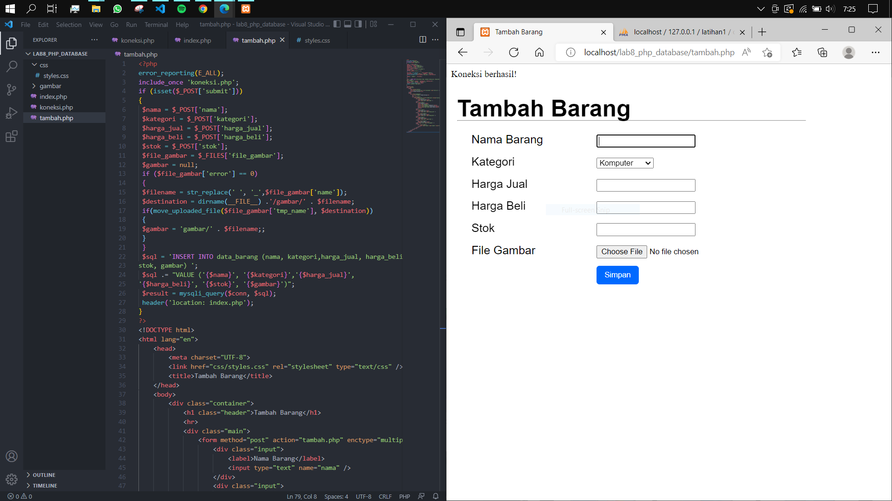

# LAB8 PHP dan Database MySQL

<table border="2" cellpading="10">
  <tr>
    <td><b>Nama</b></td>
    <td>Ilham Nur Utomo</td>
  </tr>
  <tr>
    <td><b>NIM</b></td>
    <td>312010129</td>
  </tr>
  <tr>
    <td><b>Kelas</b></td>
    <td>TI.20.A1</td>
  </tr>
  <tr>
    <td><b>MataKuliah</b></td>
    <td>Pemrograman Web</td>
  </tr>
</table>

# <b>Praktikum</b>

## <b>1. Membuat Database </b>

- Dengan SQL.
- Jalankan Apache dan MySql pada XAMPP.
- Akses ke browser ``http://localhost/phpmyadmin``
- Pada kolom SQL, ketikkan kode ``CREATE DATABASE latihan1;``

## <b>2. Membuat Tabel </b>

- Klik database latihan1.
- Pada kolom SQL, ketikkan kode 
```
CREATE TABLE data_barang (
 id_barang int(10) auto_increment Primary Key,
 kategori varchar(30),
 nama varchar(30),
 gambar varchar(100),
 harga_beli decimal(10,0),
 harga_jual decimal(10,0),
 stok int(4)
);
```

## <b>3. Menambahkan Data </b>

- Klik tabel data_barang.
- Pada kolom SQL, ketikkan kode 
```
INSERT INTO data_barang (kategori, nama, gambar, harga_beli, harga_jual, stok)
VALUES ('Elektronik', 'HP Samsung Android', 'hp_samsung.jpg', 2000000, 2400000, 5),
('Elektronik', 'HP Xiaomi Android', 'hp_xiaomi.jpg', 1000000, 1400000, 5),
('Elektronik', 'HP OPPO Android', 'hp_oppo.jpg', 1800000, 2300000, 5);
```
- Isi tabel data_barang


## <b>4. Memulai program CRUD </b>

- Buat folder, kemudian akses browser ``http://localhost/lab8_php_database``.

## <b>5. Koneksi Database </b>

- Mengkoneksikan program php nantinya, dengan database sebelumnya, ``latihan1``.

## <b>6. Menampilkan Data </b>

- Tampilan ``index.php``. Berisi data-data dari ``latihan1``.

## <b>7. Menambah Data </b>

- Untuk mengaksesnya, klik ``Tambah barang [+]`` yang ada di pojok kiri atas.


- Contoh : menambahkan barang HP mainan.


- Barang berhasil ditambah.

## <b>8. Mengubah Data </b>

- Untuk mengaksesnya, klik ``ubah`` pada kolom Aksi.


- Mengambil contoh jika stok nya diganti menjadi 2 (sebelumnya 1).


- Stok berhasil diubah.

## <b>10. Menghapus Data </b>

- Memilih baris 4, kemudian klik tombol ``hapus``.


- Berhasil dihapus.